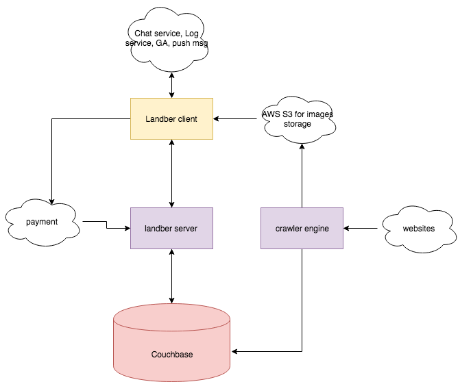
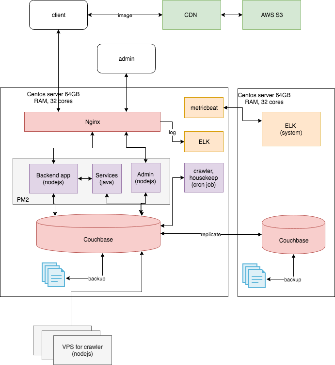

## Software stack

* Lighweight framework have been choosen for fast development mostly base on JS language
* Web client: AngularJS - Rich client
* Mobile App: React Native - Mobile cross-platform to build native UI of IOS and Android app. 
* Backend: NodeJS - HAPI
* Service/Job: Java springboot - For heavy task
* DB: couchbase - NoSQL, replication, N1QL language. 

## Context

## Deployment

