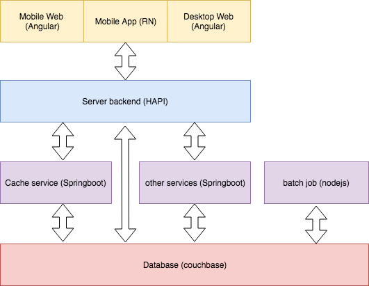

## Software stack

* Lighweight frameworks have been choosen for fast development, most of them are base on JS language
* Web client: AngularJS - Rich client, huge community
* Mobile App: React Native - Emerge mobile cross-platform to build native UI of IOS and Android app. 
* Backend: NodeJS - HAPI
* Service/Job: Java springboot - For heavy task, run as microservice
* DB: couchbase - NoSQL, replication, N1QL language. 

## Context Diagram

## Deployment Diagram

